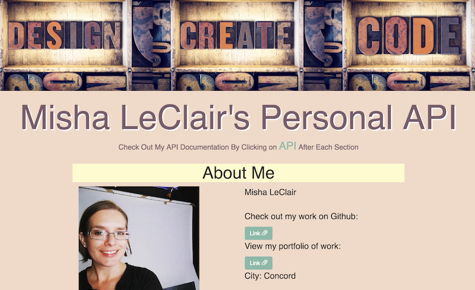

Misha LeClair
WDI 31
# Weekend Lab - Personal API

## Objective

Create a personal API that includes both hard-coded data and a form that uses JSON API endpoints and REST-ful routes (GET, POST, UPDATE, DELETE).



## Links

Live URL:
https://afternoon-plains-79332.herokuapp.com/
GitHub Repository: https://github.com/sfnewzgirl/express-personal-api

## Technologies Used
* mongoDB/mongoose
* Node.JS/Express
* JavaScript (jQuery)
* AJAX calls
* Handlebars
* Bootstrap
* HTML
* CSS
* Postman

## Reflection

I had a lot of fun during this project. It was a great exercise in implementing all the new concepts from the week about servers and databases. It put into practice how all those pieces fit together. I also had to revisit and implement Handlebars and Bootstrap, which weren't so fresh in my mind.

I took this project step by step, with an intent to solidify all the backend code piece by piece to increase my comprehension of the week's instruction. I focused on working functionality, and used Postman to test all my routes before touching HTML and styling.

While my deliverable may seem simple at first glance, I learned a ton and am very proud of the work I did.

## Code Examples

There were lots of pieces throughout the project I'm proud of. I highlight this small example of problem solving I did working with Bootstrap. I had three images I wanted to string together as one banner image.

Here are the ```div``` classes I created to make a container for each one.

```<div class="container-fluid">
  <div class="row">
    <div class="col-sm-4 design-block">
    </div>
    <div class="col-sm-4 create-block">
    </div>
    <div class="col-sm-4 code-block">
    </div>
  </div>
</div>

```
Then I used CSS to style each image inside their container.

```
.design-block {
  background-size: 100%;
  background-size: cover;
  background-position: center center;
  vertical-align: top;
  height: 270px;
  background-image: url("../images/designblocks.jpeg");
}
```
